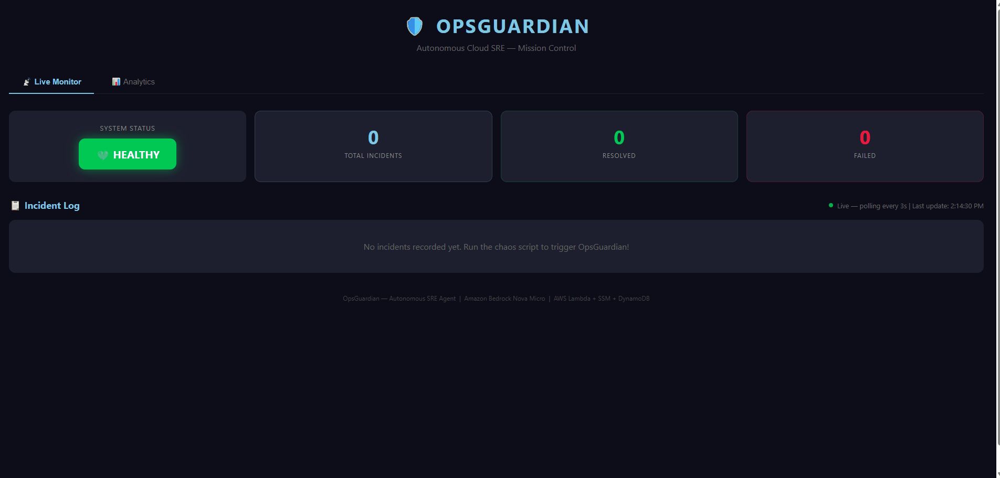
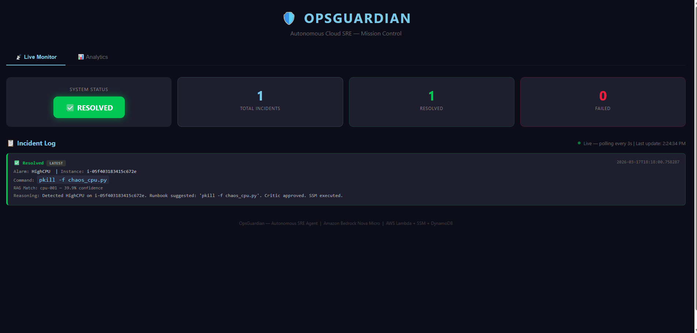
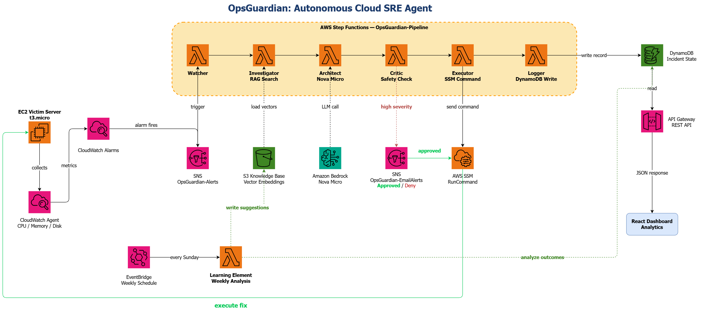

# 🛡️ OpsGuardian
### Autonomous Cloud Site Reliability Engineering Agent


> **OpsGuardian solves the Asymmetric Failure Problem** — cloud systems fail at machine speed, but manual debugging happens at human speed. OpsGuardian closes that gap with a 6-agent autonomous pipeline that detects, diagnoses, and remediates infrastructure failures in under **120 seconds** — without human intervention.

---

## 🎬 Live Demo

### System starts healthy — no incidents recorded


### Chaos script triggers — OpsGuardian detects, diagnoses, and auto-remediates


**[🚀 View Live Mission Control Dashboard](http://opsguardian-dashboard.s3-website.us-east-2.amazonaws.com/)**

---

## 🏗️ Architecture



OpsGuardian is a **true Multi-Agent System (MAS)** — six specialized AI agents, each an independent AWS Lambda microservice, orchestrated by AWS Step Functions into a fault-tolerant distributed pipeline with semantic reasoning, safety gates, and human oversight.

---

## ⚡ Key Metrics

| Metric | Value |
|---|---|
| MTTR Reduction | 15 min → **<90 seconds** |
| Infrastructure Cost | **$0.00/month** (100% AWS Free Tier) |
| Alarm Types Monitored | CPU, Memory, Disk |
| Specialized AI Agents | **6** independent Lambda microservices |
| AWS Services Integrated | **13** |
| RAG Embedding Dimensions | **1,024** (Amazon Titan Embeddings V2) |
| Safety Blocklist Patterns | **10** |
| Semantic Search Threshold | **0.25 cosine similarity** |

---

## 🤖 The Six-Agent Pipeline

| Agent | Type | AWS Service | Responsibility |
|---|---|---|---|
| 🔍 **Watcher** | Simple Reflex | CloudWatch + SNS | Monitors CPU/Memory/Disk, triggers pipeline on threshold breach |
| 🧠 **Investigator** | Model-Based Reflex | Lambda + S3 + Titan | Semantic RAG search across 1,024-dimension vector knowledge base |
| 🏗️ **Architect** | Goal-Based | Lambda + Bedrock | LLM reasoning to determine exact remediation command |
| 🛡️ **Critic** | Safety Agent | Lambda | 10-pattern blocklist validation before any execution |
| ⚡ **Executor** | Action Agent | Lambda + SSM | Remote command execution on EC2 via Systems Manager |
| 📝 **Logger** | Learning Agent | Lambda + DynamoDB | Full incident audit trail + command outcome tracking |

### Pipeline Flow

```
CloudWatch Alarm
      │
      ▼
  SNS Topic (OpsGuardian-Alerts)
      │
      ▼
┌─────────────┐     ┌───────────────┐     ┌─────────────┐     ┌───────────┐
│   Watcher   │────▶│ Investigator  │────▶│  Architect  │────▶│  Critic   │◀── 10-pattern blocklist
│ (Entry Point)│     │  (RAG + Titan)│     │ (Nova Micro)│     └───────────┘
└─────────────┘     └───────────────┘     └─────────────┘           │
                           │                     │            ┌──────┴───────┐
                     S3 Vectors            Bedrock LLM    Medium/Low    High/Critical
                                                               │               │
                                                               ▼               ▼
                                                         ┌──────────┐  ┌──────────────────┐
                                                         │ Executor │  │  WaitForApproval │◀── Email Gate
                                                         │  (SSM)   │  │   (15 min TTL)   │
                                                         └──────────┘  └──────────────────┘
                                                               │               │
                                                               └───────┬───────┘
                                                                       ▼
                                                                 ┌──────────┐
                                                                 │  Logger  │──▶ DynamoDB
                                                                 └──────────┘
```

---

## 🔎 Intelligence Layer: Semantic RAG Pipeline

OpsGuardian doesn't pattern-match on keywords — it **understands** alarm descriptions semantically.

The Investigator agent uses **Amazon Titan Embeddings V2** to generate 1,024-dimensional vectors for each runbook entry at build time. At runtime, the incoming alarm description is embedded and compared via **cosine similarity** — enabling correct matching of novel alarm descriptions the system has never seen before.

```
Query: "server is overloaded and unresponsive"
                │
                ▼
     Amazon Titan Embeddings V2
     Generates 1,024-dim vector
                │
                ▼
     Cosine Similarity Search
     across S3 knowledge base
                │
                ▼
  HighCPU entry matched — 52% confidence ✅
  Fix: pkill -f chaos_cpu.py
  Passed to Architect for LLM reasoning
```

The system correctly matched `"server is overloaded and unresponsive"` to the HighCPU runbook entry with no exact keyword overlap — the core capability for production-grade autonomous SRE.

---

## 🛡️ Safety Architecture — Three Independent Layers

**Layer 1 — Critic Agent Blocklist**

Every Bedrock-proposed command is validated before execution:

```python
BLOCKLIST = [
    'rm -rf /',        # root deletion
    'rm -rf ~',        # home deletion
    'mkfs',            # disk format
    'dd if=/dev/zero', # disk wipe
    ':(){:|:&};:',     # fork bomb
    'chmod -R 777 /',  # full permission override
    '> /dev/sda',      # device overwrite
    ...
]
```

**Layer 2 — Human-in-the-Loop Approval Gate**

High and critical severity incidents pause the Step Functions pipeline using **AWS Step Functions callback tokens**. The on-call engineer receives a full-context approval email with one-click Approve/Deny links. The pipeline resumes only on explicit approval — or auto-expires after 15 minutes routing to `LogExpired`.

```
High severity alarm fires
        │
        ▼
  WaitForApproval ◀── Step Functions PAUSES here
        │
        ▼
  Email sent:
  - Instance ID + alarm type + severity
  - Proposed command + RAG confidence
  - AI reasoning
  - [APPROVE] link  [DENY] link
        │
   ┌────┴────┐
   ▼         ▼
Approved   Denied
   │         │
ExecuteSSM LogDenied
```

**Layer 3 — Principle of Least Privilege IAM**

Separate IAM roles for EC2 and Lambda with scoped inline policies. No function has permissions beyond its specific role requirement.

---

## 📊 Mission Control Dashboard

Real-time React dashboard deployed on S3 static hosting:

- **Live Monitor tab** — polls REST API every 3 seconds, displays incident cards with alarm type, command, RAG confidence score, and AI reasoning
- **Analytics tab** — MTTR gauge, success rate donut chart, 7-day trend line, incidents by hour, command success rates (Recharts)
- **System status badge** — 💚 HEALTHY / ✅ RESOLVED / ❌ FAILED

---

## 🔥 Chaos Engineering Test Suite

All three failure modes validated end-to-end:

| Script | Technique | Threshold | Result |
|---|---|---|---|
| `chaos_cpu.py` | `multiprocessing.Process` burns all cores (bypasses Python GIL) | CPU ≥ 80% | ✅ Auto-resolved |
| `chaos_memory.py` | Allocates 1MB chunks reading `/proc/meminfo` live | Memory ≥ 70% | ✅ Auto-resolved |
| `chaos_disk.sh` | Writes 1GB files to root partition with `dd` | Disk ≥ 80% | ✅ Auto-resolved |

---

## 🧠 Self-Healing Runbook — The Learning Element

A weekly **EventBridge-scheduled Lambda** analyzes command success rates across DynamoDB incident history:

1. Scans all incidents from the past 7 days
2. Groups by command and computes success rate
3. Commands below 50% success → asks Bedrock to suggest better alternatives
4. Writes AI-generated suggestions to S3 `pending_updates/` for human review
5. Sends summary report email via SNS

The system improves its own knowledge base autonomously — human reviews before changes go live.

---

## ☁️ AWS Services Architecture

| Service | Role | Free Tier |
|---|---|---|
| AWS Lambda | 11 agent + API functions | 1M invocations/month |
| AWS Step Functions | Pipeline orchestration | 4,000 transitions/month |
| Amazon DynamoDB | Incident state + pending approvals | 25GB storage |
| Amazon S3 | Vector knowledge base + dashboard hosting | 5GB storage |
| Amazon CloudWatch | Metric alarms + agent logging | 10 alarms free |
| Amazon Bedrock Nova Micro | LLM reasoning (Architect agent) | ~$0.00001/call |
| Amazon Titan Embeddings V2 | Vector generation (Investigator agent) | ~$0.000001/call |
| AWS SSM | Remote command execution on EC2 | Free on EC2 |
| Amazon SNS | Alert notifications + approval emails | 1,000/month free |
| API Gateway REST | Status + analytics + approval endpoints | 1M calls/month |
| Amazon EC2 t3.micro | Victim server for chaos testing | 750 hrs/month |
| Amazon EventBridge | Weekly learning schedule | 5M events/month |
| CloudWatch Agent | Custom memory + disk metrics | Free on EC2 |

**Total infrastructure cost: $0.00/month**

---

## 💡 Key Engineering Decisions

| Decision | Choice | Why | Alternative Considered |
|---|---|---|---|
| Agent framework | Native `boto3` SDK | Zero latency, no persistent servers, free tier compatible | LangChain, AutoGen |
| LLM | Nova Micro + Titan Embeddings V2 | Fractions of a cent per call, native AWS | Claude/GPT-4 (100x+ cost) |
| Orchestration | AWS Step Functions Standard | Visual workflow, callback tokens, audit history | EventBridge pipes, SQS |
| Vector store | S3 JSON file | Free, zero ops overhead, sufficient for <100 entries | Pinecone, OpenSearch |
| Compute | Lambda serverless | No idle cost, event-driven natively | EC2 always-on agent |
| API type | REST API (not HTTP API) | Stage management, request/response control | HTTP API |
| SNS topology | Two separate topics | Prevents infinite loop — agent triggers vs human notifications | Single topic (caused recursive invocations in testing) |

---

## 🚀 Lessons Learned

**SNS infinite loop** — Routing approval emails through the same SNS topic that triggers agents caused recursive Lambda invocations generating 1,000+ emails in minutes. Fixed by creating separate `OpsGuardian-Alerts` (agent triggers only) and `OpsGuardian-Email-Alerts` (human notifications only) topics.

**Python GIL limitation** — Single-threaded chaos script only utilized 1 CPU core, plateauing at 50% utilization. Fixed with `multiprocessing.Process` spawning one process per core for true multi-core saturation.

**Titan embedding score calibration** — Titan Embeddings V2 produces conservative similarity scores (0.25–0.52 range). Threshold tuned empirically to 0.25 rather than assuming standard 0.7+ cutoffs used by other embedding models.

**Nova Micro API format** — Content field must be an array `[{"text": prompt}]` not a plain string. Requires cross-region inference profile prefix `us.amazon.nova-micro-v1:0` rather than the base model ID.

**CloudWatch metric publishing window** — EC2 basic monitoring publishes metrics every 5 minutes. Chaos scripts extended to 5+ minutes to ensure CPU spike is captured within the metric publication window.

---

## 📁 Repository Structure

```
opsguardian/
├── backend-agent/              # Lambda functions (Python 3.12)
│   ├── watcher.py              # Entry point — starts Step Functions
│   ├── investigator.py         # RAG vector search (Titan Embeddings V2)
│   ├── architect.py            # LLM reasoning (Bedrock Nova Micro)
│   ├── critic.py               # Safety validation (10-pattern blocklist)
│   ├── executor.py             # SSM command execution
│   ├── logger.py               # DynamoDB audit trail
│   ├── approval_gate.py        # Human-in-Loop gate (task token)
│   ├── approval_handler.py     # Approve/deny click handler
│   ├── api_handler.py          # REST API (GET /status)
│   ├── analytics.py            # Analytics API (GET /analytics)
│   └── learning_element.py     # Weekly self-improvement agent
├── chaos-engineering/          # Fault injection test scripts
│   ├── chaos_cpu.py            # Multi-core CPU stress (multiprocessing)
│   ├── chaos_memory.py         # RAM allocation (/proc/meminfo)
│   └── chaos_disk.sh           # Root partition fill (dd)
├── frontend-dashboard/         # React Mission Control UI
│   └── src/App.js              # Tabbed dashboard: Live Monitor + Analytics
├── knowledge-base/             # RAG knowledge base
│   ├── runbook_rich.json       # 5 runbook entries with descriptions + severity
│   └── build_embeddings.py     # Titan V2 vector builder script
├── infrastructure/             # IAM policies as JSON
│   ├── lambda-role-policy.json
│   └── ec2-role-policy.json
└── docs/                       # Architecture diagram + demo GIFs
    ├── architecture.png
    ├── OpsGuardian1.gif
    └── OpsGuardian2.gif
```

---

## 📈 Sprint History

| Sprint | Feature | Status |
|---|---|---|
| 0 | Environment setup, IAM, Zero Spend Budget, GitHub | ✅ |
| 1 | EC2 victim server, chaos engineering, CloudWatch alarm | ✅ |
| 2 | Lambda brain, Bedrock integration, SSM execution | ✅ |
| 3 | S3 runbook, Critic safety agent, DynamoDB logging | ✅ |
| 4 | React dashboard, REST API, S3 static hosting | ✅ |
| 5 | AWS Step Functions distributed multi-agent orchestration | ✅ |
| 6 | Real RAG with Titan Embeddings V2, cosine similarity search | ✅ |
| 7 | CloudWatch Agent, CPU + Memory + Disk multi-symptom detection | ✅ |
| 8 | Human-in-the-Loop approval gate with Step Functions callback tokens | ✅ |
| 9 | Operational analytics dashboard with Recharts | ✅ |
| 10 | Self-healing runbook, Learning Element, EventBridge schedule | ✅ |
| 11 | Professional README, architecture diagram, demo GIFs | ✅ |
| 12 | GitHub Actions CI/CD pipeline | 🔜 |
| 13 | CloudFormation Infrastructure as Code | 🔜 |

---

## 🛠️ Tech Stack

**Cloud Infrastructure**
`AWS Lambda` `AWS Step Functions` `Amazon DynamoDB` `Amazon S3` `Amazon CloudWatch` `Amazon SNS` `AWS SSM` `Amazon API Gateway` `Amazon EC2` `Amazon EventBridge` `AWS IAM` `CloudWatch Agent`

**AI & Machine Learning**
`Amazon Bedrock Nova Micro` `Amazon Titan Embeddings V2` `RAG (Retrieval Augmented Generation)` `Cosine Similarity Search` `Vector Embeddings` `Prompt Engineering`

**Application**
`Python 3.12` `boto3` `React 18` `Recharts` `Axios`

---

*Built by [Vivekanandhan Kathirvel](https://www.linkedin.com/in/vivekanandhan-kathirvel-828b20253/) — USF M.S. Computer Science*
